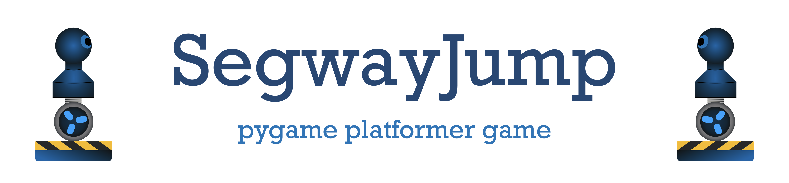

https://user-images.githubusercontent.com/66446067/231748086-65146803-a4ea-499d-8dbf-b197f4f6a5fd.mov
#
This is a complete example of a platformer game made with python and pygame. It contains a startpage, menu and splash-screen with music and sound-effects.

To start the game you need python3 with pygame installed:
```
pip3 install -r requirements.txt
```
```
python3 main.py
```


### Create standalone application
The provided ``setup.py`` creates a standalone application for macOS with py2app:
```
python3 setup.py py2app
```
For Windows you would need to use py2exe instead and modify the ``setup.py`` accordingly.
